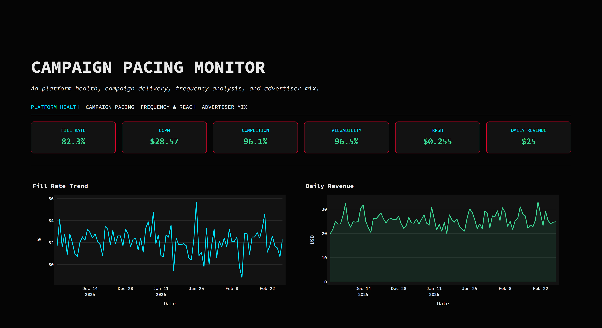

# Draupnir

**Ad platform analytics, from zero.** Synthetic ad-supported streaming telemetry
generated with domain-appropriate distributions, loaded into Postgres, modelled with
dbt into a conformed dimensional layer, and surfaced through a campaign pacing
monitor. The framing is the founding analytics engineer's problem: nothing exists,
stakeholders arrive with questions rather than requirements, and the job is to
decide what to measure before anyone can decide what to do.

Split out of a shared monorepo on 2026-07-19 and now self-contained: its own
Postgres, its own dbt project, its own compose stack.



Rendered from the compose quick-start below, which seeds a reduced dataset for a
fast cold start. The rates are the point and they are realistic: 82.3% fill, a
$28.57 eCPM, an 8.5 ads-per-viewing-hour load giving $0.255 RPSH. The absolute
daily revenue is small because the sample is, and it scales with `--subscribers`.

The app is built to be embedded: it takes its colour palette from URL query
params so it can match the host page, validates every incoming value against a
strict hex allowlist, and hides Streamlit's own chrome so the surrounding site
provides the frame.

## Run it

```bash
cp .env.example .env               # set DB_PASSWORD and READER_DB_PASSWORD
docker compose up -d db            # Postgres 16, bound to 127.0.0.1
docker compose --profile seed up   # generate, load, dbt build
docker compose up -d app           # http://localhost:8503
```

That `.env` is for local development. Deployed, there is no `.env`: the two
credentials are decrypted on the operator's workstation and injected as
environment variables, and the app reads them from the process environment
without knowing how they got there. Both published ports bind loopback, so a
reverse proxy is the only public listener. See `SECURITY.md`.

Grants run after dbt, not before: dbt creates the schemas, and granting on a
schema that does not exist yet is a silent no-op. `data/grant_reader_access.py`
is a separate step for that reason.

A cold run from an empty volume produces **326 dbt nodes green** (23 models and
303 data tests, zero errors) and **208 Python tests**, with the app healthy on
:8503. Every figure in this README comes from that run at seed 42, which is the
point: a number that cannot be reproduced from a clean clone is not a result.

## What's inside

| Path | What |
|---|---|
| `app/` | Streamlit "Campaign Pacing Monitor" (Python 3.12, port 8503). 4 tabs: platform health, campaign pacing, frequency and reach, advertiser mix. Metric thresholds live in `metrics.py`, warehouse reads in `db.py` |
| `dbt/` | 23 models: 8 staging views, 9 marts (6 dims + 3 facts), 6 analytics tables. 303 data tests, of which 8 are singular reconciliation tests |
| `data/` | Generator (seed 42), loader, and the post-dbt grant script (Python 3.12). Property tests in `data/tests` |
| `docs/` | `CASE_STUDY.md`: the long-form narrative and metric definitions |
| `project.yaml` | How this appears on lukeudell.com |

## The dataset

At the generator's defaults: 50,000 subscribers · 100 advertisers · 500
campaigns · 2,000 content items · ~141,000 viewing sessions · ~500,000 ad
requests · ~410,000 impressions · 2025-12-01 to 2026-03-01 · seed 42.

Two of those are derived rather than chosen, which is what makes the published
rates reproducible instead of decorative:

- **Sessions come first.** A viewing session is one subscriber's sitting with
  one title. How far it gets decides both how long it was watched and how many
  ad breaks it passed, from a single draw, so ad load is a consequence of
  viewing rather than an independent knob. `--requests` is a target that is
  converted into a session count.
- **Impressions follow fill rate.** Fill is a Bernoulli draw per request at
  `--fill-rate`, and every filled request produces exactly one impression, so
  the count lands near `requests × fill_rate`.

The compose quick-start above seeds a smaller set for a fast cold start: 10,000
subscribers, 28,169 sessions, ~100,000 requests, ~82,000 impressions, 9,614
viewing hours, same seed and the same distributions. Pass `--requests` and
`--subscribers` for the full volume.

Not random noise. Bid CPM is log-normal around a per-vertical mean, ranging from $18
(QSR) to $40 (Finance), because ad pricing is set by what the category can bear.
Recorded revenue applies a second-price discount of 0.7–1.0 to the bid, because
that is how the auction actually clears. Request timing follows a Gaussian diurnal
curve peaking at 20:30 with weekends weighted ×1.2, because streaming is prime-time
behaviour. Subscriber and content popularity are Pareto-weighted, because a small
number of heavy viewers and hit titles carry most of the volume. Completion and
viewability are drawn per impression against per-slot base rates that decay by
position:

| Slot | Duration | Completion | Viewability |
|---|---|---|---|
| `pre_roll_1` | 15s | 0.92 | 0.95 |
| `pre_roll_2` | 30s | 0.88 | 0.93 |
| `mid_roll_1` | 15s | 0.80 | 0.88 |
| `mid_roll_2` | 30s | 0.75 | 0.85 |
| `mid_roll_3` | 15s | 0.70 | 0.82 |
| `post_roll_1` | 15s | 0.55 | 0.60 |

The fill rate is 82% by construction: it is an argument to the generator, every
filled request produces exactly one impression, and the impression count is
derived from it. So 18% of requests go unfilled and show up as lost revenue in
`mart_platform_health`. Two tests hold that claim in place: a property test on
the generator's own distributions, and a dbt reconciliation test asserting that
the `was_filled` flag and the fact table agree on the count.

## The metrics

Eight metrics, each chosen to answer a question a stakeholder asks in the first 90
days. All eight are computed, and each threshold has a test.

| # | Metric | Formula | Thresholds | Where |
|---|---|---|---|---|
| 1 | Fill rate | `impressions / ad_requests` | <70% investigate · 80–90% healthy · >95% supply constrained | `mart_platform_health` |
| 2 | eCPM | `(revenue / impressions) × 1000` | <$8 below market · $12–25 healthy · >$30 premium | `mart_platform_health` |
| 3 | Completion rate | `completed / started` | pre-roll ~92% · mid-roll ~85% · post-roll ~55% | `mart_platform_health` |
| 4 | Viewability | `viewable / total` (IAB: 50% of pixels for 2 continuous seconds) | <60% below standard · ~70% benchmark · >80% premium | `mart_platform_health` |
| 5 | RPSH | `ad_revenue / viewing_hours` | <$0.15/hr under-monetised · $0.15–0.35/hr healthy · >$0.35/hr churn risk | `mart_platform_health` |
| 6 | Budget pacing ratio | `cumulative_spend / (elapsed_days/flight_days × budget)`, flight progress capped at 1.0 | <0.9 under · 0.9–1.1 on pace · >1.1 over · null is `UNKNOWN`, never on pace | `fct_campaign_daily` |
| 7 | Frequency cap compliance | `subscribers_exceeding_cap / total_reached` | <2% target · 2–5% investigate · >5% ad fatigue | `mart_frequency_analysis` |
| 8 | Advertiser concentration (HHI) | `Σ(market_share²)` over percent shares | <1500 diversified · 1500–2500 moderate · >2500 concentrated | `mart_advertiser_concentration` |

Metric 5 is worth a paragraph of its own. It was billed as "THE metric" and
computed nowhere, and building it took more than plumbing. The impression grain
already carries `view_duration_sec`, but that is how long an *ad* was watched;
dividing revenue by it gives a completion-weighted eCPM under another name. RPSH
needs content viewing time, so the generator now simulates viewing sessions and
ad breaks fall out of them, which is the right way round: ad load is a
consequence of viewing, not an independent knob.

That also corrected the thresholds. RPSH is ad load per hour times eCPM over
1000, so the published $2 / $4 / $6 per hour would have needed 160 impressions
in a viewing hour, an ad every 22 seconds. No platform reaches it. The bands
above are derived from the arithmetic instead: 6 ads/hour at a $25 eCPM is
$0.15, 14 ads/hour is $0.35. The warehouse observes $0.238 at 8.5 ads/hour.

Metric 6 is worth a paragraph. It used to ship a different formula against a
different baseline with different thresholds, comparing a day's spend to that
campaign's own average day. That measures whether a day was unusual, not whether
an advertiser will get what they paid for, and because the baseline moves with
the spend it can never show systematic under-delivery. Implementing the
published formula immediately exposed two upstream bugs the old metric had
concealed: campaigns were assigned to impressions with no regard for their
flight dates, and budgets were drawn from a guess unrelated to actual delivery.
Three reconciliation tests now hold the definition in place.

The material worth reading is the interaction between them: high fill with low eCPM
means selling cheap; low completion with high frequency means ad fatigue; high HHI
with over-pacing top campaigns means revenue is about to cliff.

## CI

`.github/workflows/ci.yml`, three jobs, ordered by how fast they fail:

| Job | What |
|---|---|
| App tests | theme, metrics and warehouse-degradation suites, on Python 3.12 |
| Pipeline | generator property tests, then generate, load, `dbt build`, sqlfluff and dbt docs against a real Postgres service container |
| Security | gitleaks, bandit, `pip-audit` (all blocking) and a Trivy image scan |

The pipeline job is the one worth having: it proves the generator, loader and
models still agree, against the same engine production uses. It runs `dbt build`
rather than `dbt run` on purpose: `run` executes models and skips their tests
entirely, which is how a declared test can sit in a repo for months without ever
having passed.

`pip-audit` blocks. Accepted findings are explicit `--ignore-vuln` flags with a
reason in `SECURITY.md`, not a `|| true`. Dependabot proposes weekly upgrades,
grouped per ecosystem.

## Standards

Built to a personal engineering standard: tests before features, dimensional
modelling with enforced contracts and declarative data-quality tests, no
hardcoded credentials, conventional commits, and a rule that every published
number must be reproducible from a cold clone.

`docs/CASE_STUDY.md` is the long-form version, including the metric definitions
that had to be corrected once they were actually computed.
